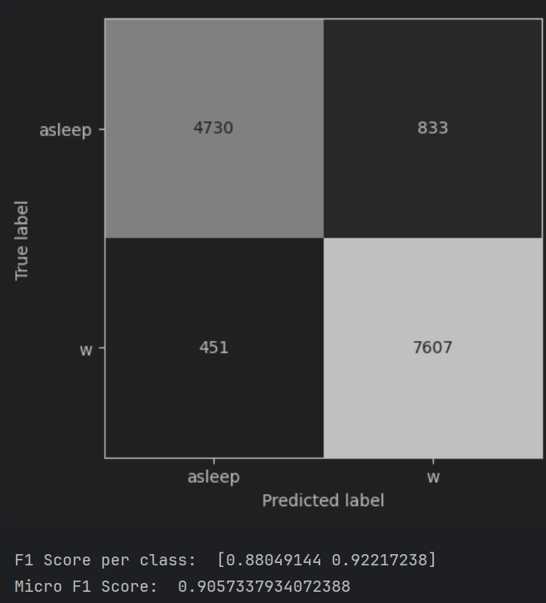
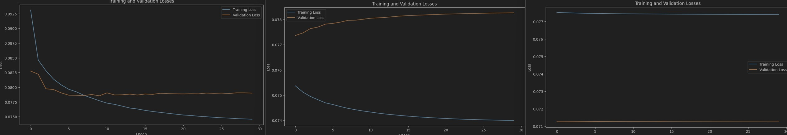
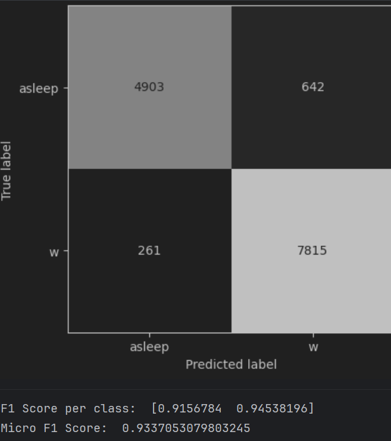
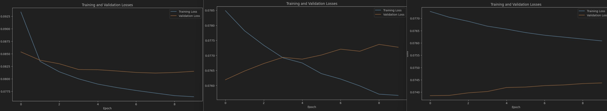
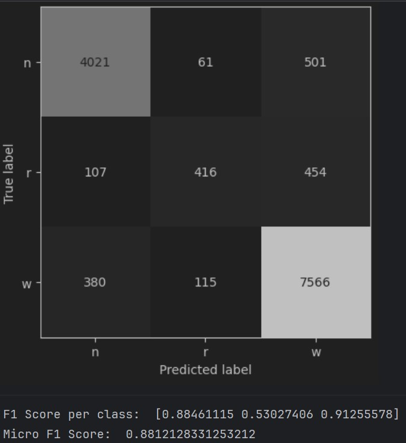
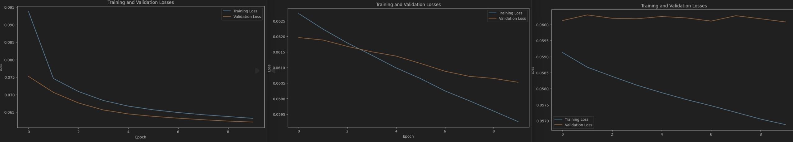
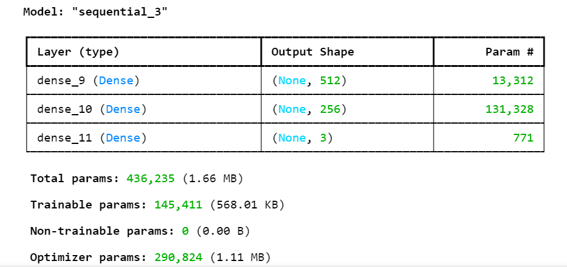
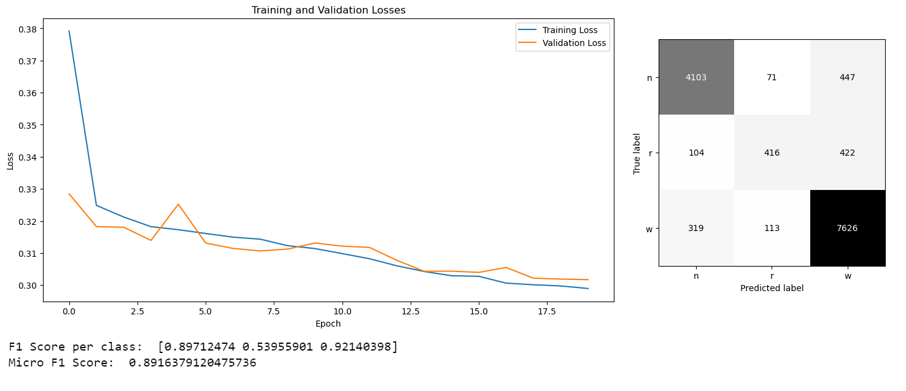
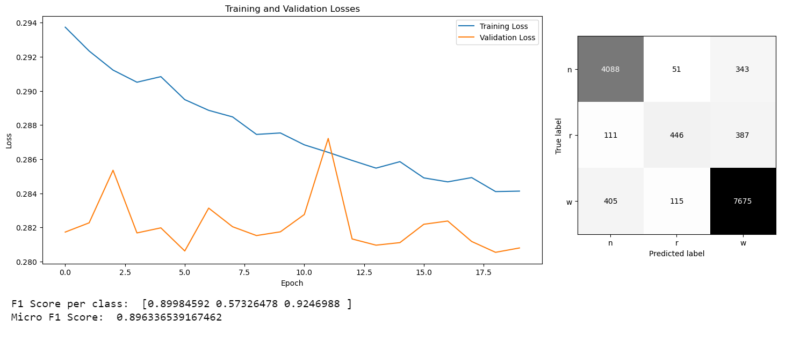
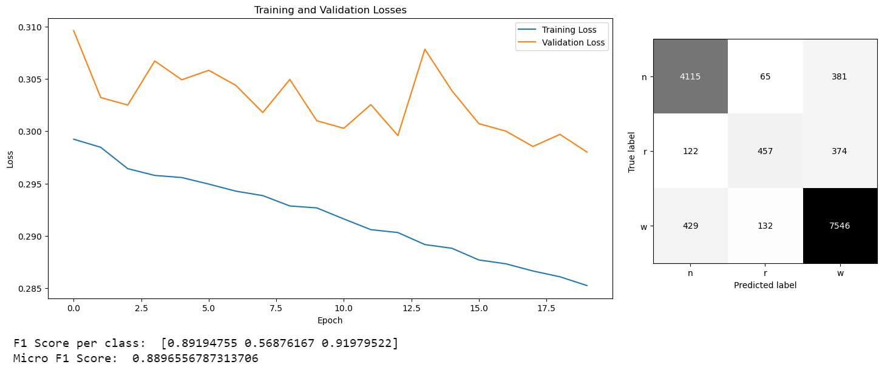

Authors :

- Adrian Barreira Romero
- Naimi Zied

Class : A

## Introduction:

This is our practical work on "Learning Artificial Neural Networks" under the supervision of Professor Andres
Perez-Uribe, with assistance from Shabnam Ataee and Simon Walther. This session focuses on utilizing Multilayer
Perceptrons (MLPs) with Keras to classify mice's sleep stages. The primary objectives are to apply acquired knowledge to
real data.

During this practical work, participants engaged in the classification of mice's sleep stages using neural networks. EEG
data from multiple mice will be employed for both training and testing purposes. Through prescribed preprocessing steps,
model training, validation procedures, and performance assessments, we will gain practical insights into MLPs' efficacy
in classification tasks.

## First experiment

### Our Process

First of all, we imported the data and structured it in a way that we could handle. We took the 25 first features and
took the first column as the target (the column with the rat's state). The normalization was made inside the k-fold.

To this program we quickly added the 3-fold that was required since it seemed better to fit_scale the training data and
transform the validation data to the scaler (we don't know what the validation data is at the time of the fit_transform
so it shouldn't affect our scale)

Then we implemented a basic program that created a MLP with keras. After that, the first thing we tried was changing the
amount of layers and Perceptrons per layer. However, we didn't see a lot of difference at first. It looked like the
problem we tried to handle was linearly separable or close to that since we reached F1_scores and accuracys around ~85%
really fast. Then we tried adding neurons, incrasing epochs and changing optimizer functions. That made us reach around
90% micro f1_score and accuracy.

Optimisation functions we sticked to :

- SGD with decay and exponential decay
- SGD
- SGD with momentum.

Another interesting fact about this experience is the fact that adding a lot of neurons was likely to make our model
overfitting, yet without going overboard, our model performed better depending on the validation data and the amount of
perceptrons and hidden layers given.

### The model

For this first experiment the model we decided to go with is this :

```
# Define the MLP model
model = Sequential()
model.add(Input(shape=(25,))) # Input layer with 25 features
model.add(Dense(64, activation='relu'))
model.add(Dense(32, activation='relu'))
model.add(Dense(y.shape[1], activation='sigmoid'))  # Number of neurons equals number of classes

# Define your learning rate
lr_schedule = keras.optimizers.schedules.ExponentialDecay(
    initial_learning_rate=0.1,
    decay_steps=10000,
    decay_rate=0.3)

# Pass the learning rate to the optimizer
sgd = SGD(learning_rate=lr_schedule, momentum=0.5)

model.compile(loss='mean_squared_error', optimizer=sgd, metrics=['accuracy'])
```

The confusion matrix and scores showed us interesting things (last validation data) :



Our model tends to predict wake more often. Probably because the wake state is more present in our data sets.

We decided to go with this model since it was the most interesting one. Because it gave good results and it used all we
learned combined, with multi-layers, SGD optimizer function with decay and momentum, and relu/sigmoid activation
function. However, we can see a bit of overfitting for the first and second validation set, for the third fold it showed
a really good score (confusion matrix above).



For the first 2 folds we can see that training 2-3 epochs allowed us to get the best loss function anything beyond
that caused overfitting. We might have wanted to stop there or decrease the perceptron amount / layers. However the
result varied a lot with each data validation fold and this model showed the best results for third fold. Furthermore,
the decay rate's impact allowed us to benefit from the initial improvement that we can
see in the loss function.
The chosen learning rate is 0.01 since we don't want anything too big but not too small either, ideally we should try a
lot of learning rates and train the model several times to see the outcomes. That's what we did but we did not
automatise the process and did it by hand.

### Another model ?

Another thing we noted in this experiment is that by adding perceptrons we could get really nice scores with our SGD.
For example :

```
# Define the MLP model
model = Sequential()
model.add(Input(shape=(25,))) # Input layer with 25 features
model.add(Dense(400, activation='relu'))
model.add(Dense(200, activation='relu'))
model.add(Dense(100, activation='relu'))
model.add(Dense(y.shape[1], activation='sigmoid'))  # Number of neurons equals number of classes

# Define your learning rate
lr_schedule = keras.optimizers.schedules.ExponentialDecay(
    initial_learning_rate=0.1,
    decay_steps=10000,
    decay_rate=0.3)

# Pass the learning rate to the optimizer
sgd = SGD(learning_rate=lr_schedule, momentum=0.5)

model.compile(loss='mean_squared_error', optimizer=sgd, metrics=['accuracy'])
```

We wanted to show this model because it gave us way better results as shown here :




This one is interesting because once again we can see overfitting but it looks like the initial training in the the
first fold got the best result across all validations. Adding any more training was bad.

We created a notebook for this experiment. it's named lab3_BarreiraRomero_AnotherModel

### Problems found

Since it was the first time having to implement a MLP a lot of time was lost on understanding the libraries (Keras and
matplotlib).
Furthermore we wanted to try different optimizers and had to "custimize" them ourselves which took some time.
Matplotlib was also complicated to handle at times and having it display the informations we wanted.

## Second experiment

### Our Process

Compared to the last experiment since we had 1 more class it was likely that we needed more perceptrons. At first, we
managed to get around 60%-80% accuracy and f1_score and it looked odd. We quickly realised it might have been because of
the low amount of perceptrons and because we didn't switch to the *softmax* activation function which should be used if
we have more than 2 classes.

We need 3 output neurons, in an ideal world we needed them to send 1 if it's the correct class and 0 if it's another
class. This adjusted automatically thanks to our code. `model.add(Dense(y.shape[1], activation='softmax'))`

Overall, for this experiment we tried again a few things but few managed

### The model used

```
# Define the MLP model
model = Sequential()
sgd_momentum = SGD(learning_rate=0.01, momentum=0.5)
model.add(Input(shape=(25,))) # Input layer with 25 features
model.add(Dense(100, activation='relu'))
model.add(Dense(50, activation='relu'))
model.add(Dense(25, activation='relu'))
model.add(Dense(y.shape[1], activation='softmax'))  # Number of neurons equals number of classes

model.compile(loss='mean_squared_error', optimizer=sgd_momentum, metrics=['accuracy'])
```

The model used provided this matrix and scores for the last validation data :




This model is interesting because, although we used less perceptrons than in the first experiment, it achived a decent
score. We wanted to showcase that, with some perceptrons we can already have a good guess at which state it is.

We trained this model for 10 epochs since it looked like in every fold and it was getting better. Training this model
longer would probably lead to better results. Since validation got better and better. Loss functions also decreased,
which is good.
We didn't want to push the model really far for this step. But we can clearly see that in each fold we approached a
better result.
The moment we want to push the model further is in the competition so we kept this challenge for that part.

Another note we wanted to add is that the model has a hard time guessing rem sleep stages, we might want to have more
data, rem doesn't look to be represented a lot so our model struggles with it.

**Important : On the third experiment / competition we reused and improved the second's experiment further. So this
model isn't everything we tested and was not the best results we found. (Check Competition)**

### Problems found

At this step a lot of times, our trained model always guessed wake (which means around 60% f1_score) or wake + sleep
forgetting rem (which was around 80% f1_score). This made us rethink a lot of things and lose some time. In the end we
figured that sigmoid activation function were a "no go" and switched to relu instead.

## Competition

### Approach

The approach taken in this code can be divided into three main steps:

1. **Data Loading and Preprocessing**:
    - The data is loaded from two CSV files and concatenated into a single DataFrame.
    - The features are selected based on the chi-squared statistical test for non-negative features.
    - The target variable is encoded into integer values. The integer labels are then converted into categorical format.

2. **Model Definition and Compilation**:
    - A Sequential model is defined with an input layer, two hidden layers, and an output layer.
    - An input layer with 25 features. This is defined implicitly by the input shape of the first layer.
    - A Dense layer (fully connected layer) with 512 neurons and a sigmoid activation function.
    - Another Dense layer with 256 neurons and a sigmoid activation function.
    - The model is compiled with a loss function of 'categorical_crossentropy' and an optimizer of 'adamax'.

   

   The number of neurons in the hidden layers, the activation function, the weight initialization method, and the
   optimizer are all parameters that were tuned. This configuration of the model is a result of both manual and
   automatic tuning. The batch size and the number of epochs were manually set. These parameters were chosen carefully
   to avoid overfitting. On the other hand, the optimizer and learning rate were determined using an automatic method,
   specifically a grid search.
   However, it's important to note that a very small learning rate, a large number of epochs or a small batch size can
   cause the model to take a long time to compile. Therefore, a balance was sought to ensure efficient learning without
   excessive computational cost.


3. **Model Training and Evaluation**: The model is trained using 3-fold cross-validation. For each fold, the training
   data is normalized, the model is trained, and the training and validation losses are plotted. The model is then
   evaluated on the validation data, and the confusion matrix and F1 scores are calculated and printed.

### Results



- Graph Description: The graph shows training and validation loss over 20 epochs. The training loss decreases steadily,
  while the validation loss oscillates but generally trends downward, indicating possible model stability.
- Confusion Matrix: The matrix suggests a moderate level of misclassification, with some errors observed among the
  predicted labels. The majority of correct predictions are along the diagonal.



- Graph Description: The loss graph shows a consistent decrease in training loss, with a more volatile validation loss.
  This volatility may indicate some instability in the model's generalization.
- Confusion Matrix: The confusion matrix demonstrates a reasonable level of correct predictions, especially for one
  class. However, there's some misclassification among the other classes.
  

- Graph Description: The graph depicts the training and validation losses over epochs. The training loss consistently
  decreases, while the validation loss experiences more fluctuations, suggesting potential issues with overfitting.
- Confusion Matrix: This matrix shows some misclassification, with significant correct predictions but also observable
  errors in the non-diagonal cells.

### Observations

The model performed well on classes 0 and 2, with F1 scores close to 0.9. However, it had difficulty classifying class
1, with an F1 score of only 0.57326478. This suggests that the model may need further tuning or additional features to
improve its performance on class 1.

Overall, the model performed well, but there is room for improvement, particularly in its performance on class 1.

## Conclusion

In conclusion, we have completed the practical work on classifying mice's sleep stages with MLPs. Throughout the
exercise, valuable insights into neural network architectures, data preprocessing, and model evaluation have been
garnered.

By effectively applying MLPs with Keras, we have successfully classified mice's sleep stages, ranging from
distinguishing between awake and asleep states to more intricate classification involving multiple sleep stages.
Thorough experimentation and analysis have addressed issues such as model performance, overfitting, hyperparameter
tuning, and optimization techniques.

Furthermore, participation in the competition segment has spurred innovative approaches to enhance model performance,
showcasing creativity and problem-solving abilities in the domain of machine learning.

Throughout the practical work, we all worked diligently, often engaging in discussions with fellow participants, which
provided valuable insights and made the experience more enriching. Regardless of the outcome, this practical work has
undoubtedly contributed to enhancing understanding and proficiency in applying artificial neural networks to practical
datasets.
