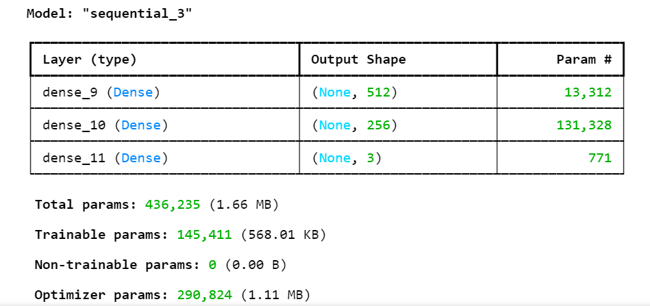
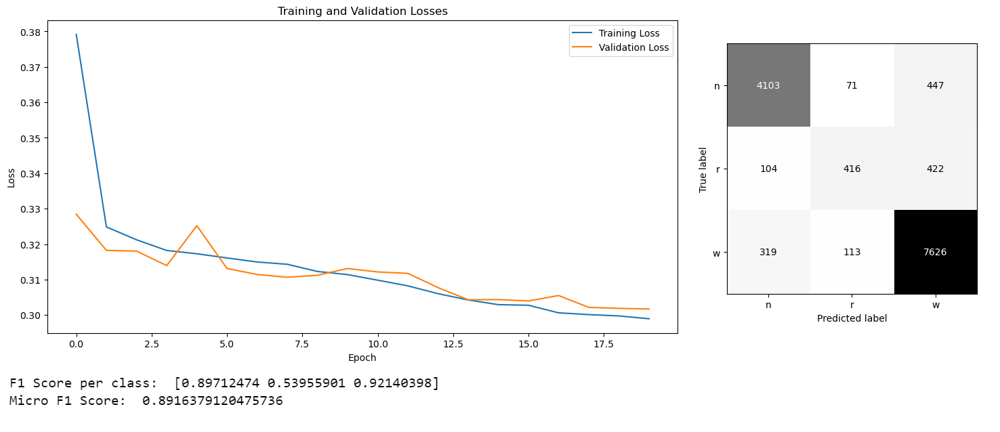
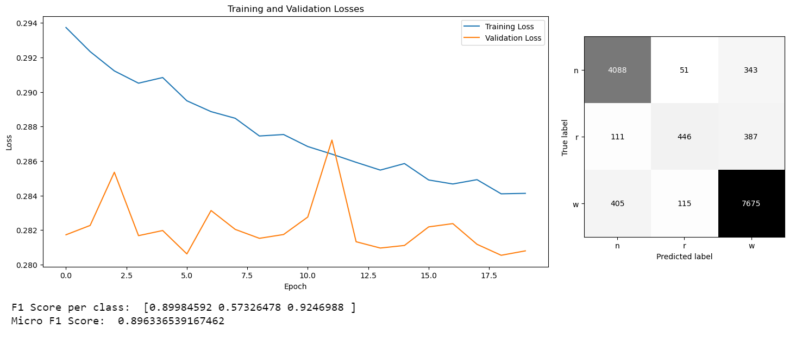
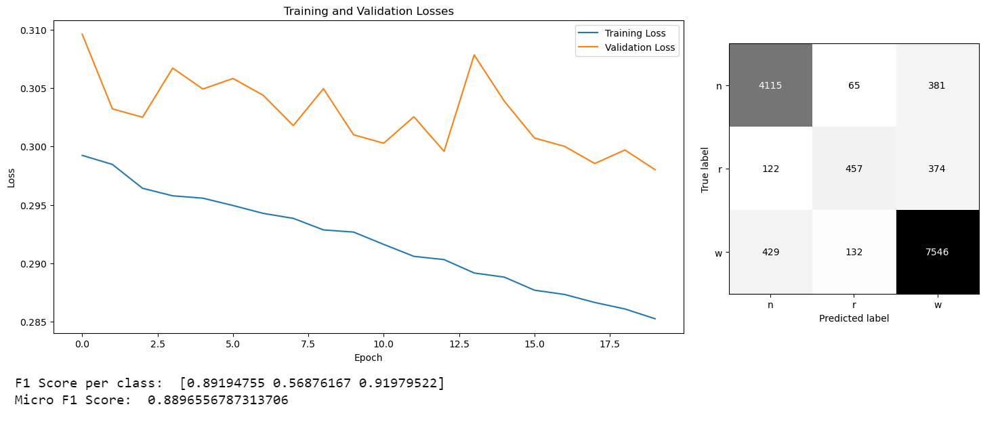

## Competition

### Approach

The approach taken in this code can be divided into three main steps:

1. **Data Loading and Preprocessing**: 
   - The data is loaded from two CSV files and concatenated into a single DataFrame. 
   - The features are selected based on the chi-squared statistical test for non-negative features.
   - The target variable is encoded into integer values. The integer labels are then converted into categorical format.

2. **Model Definition and Compilation**: 
   - A Sequential model is defined with an input layer, two hidden layers, and an output layer. 
   - An input layer with 25 features. This is defined implicitly by the input shape of the first layer.  
   - A Dense layer (fully connected layer) with 512 neurons and a sigmoid activation function.  
   - Another Dense layer with 256 neurons and a sigmoid activation function.
   - The model is compiled with a loss function of 'categorical_crossentropy' and an optimizer of 'adamax'.

    

    The number of neurons in the hidden layers, the activation function, the weight initialization method, and the optimizer are all parameters that were tuned. This configuration of the model is a result of both manual and automatic tuning. The batch size and the number of epochs were manually set. These parameters were chosen carefully to avoid overfitting. On the other hand, the optimizer and learning rate were determined using an automatic method, specifically a grid search. 
    However, it's important to note that a very small learning rate, a large number of epochs or a small batch size can cause the model to take a long time to compile. Therefore, a balance was sought to ensure efficient learning without excessive computational cost.

3. **Model Training and Evaluation**: The model is trained using 3-fold cross-validation. For each fold, the training data is normalized, the model is trained, and the training and validation losses are plotted. The model is then evaluated on the validation data, and the confusion matrix and F1 scores are calculated and printed.

### Results

- Graph Description: The graph shows training and validation loss over 20 epochs. The training loss decreases steadily, while the validation loss oscillates but generally trends downward, indicating possible model stability.
- Confusion Matrix: The matrix suggests a moderate level of misclassification, with some errors observed among the predicted labels. The majority of correct predictions are along the diagonal.

- Graph Description: The loss graph shows a consistent decrease in training loss, with a more volatile validation loss. This volatility may indicate some instability in the model's generalization.
- Confusion Matrix: The confusion matrix demonstrates a reasonable level of correct predictions, especially for one class. However, there's some misclassification among the other classes.

- Graph Description: The graph depicts the training and validation losses over epochs. The training loss consistently decreases, while the validation loss experiences more fluctuations, suggesting potential issues with overfitting.
- Confusion Matrix: This matrix shows some misclassification, with significant correct predictions but also observable errors in the non-diagonal cells.

### Observations

The model performed well on classes 0 and 2, with F1 scores close to 0.9. However, it had difficulty classifying class 1, with an F1 score of only 0.57326478. This suggests that the model may need further tuning or additional features to improve its performance on class 1. 

Overall, the model performed well, but there is room for improvement, particularly in its performance on class 1.